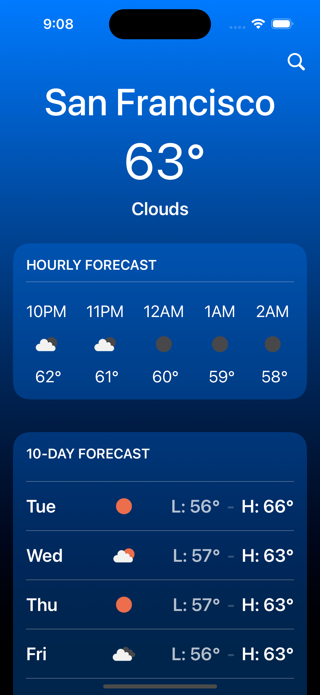

# ChaseWeather
Coding challenge exercise for WeatherApp use case for Chase iOS team. 

|Location Permission|Home Weather|Search|Error Handling|
|---|---|---|---|
|||||

## Environment
- Xcode version - 15.4
- iOS 17 - Used onChange() APIs
- Targets - `ChaseWeather` Main App, `Core` Reusable Components, `Home` Weather Home and Search.

## Setup and functionalities
- Architecture - MVVM with Protocols and DI
- Modular with SPM, divided to Main App, Core and Home
- SwiftUI
- Combine
- Async/Await
- CoreLocation for LocationPermission
- Persistence of last known Location
- Unit Tests

## Flow Hierarchy
- Home [Responsible for global data changes]
    - Current Location Card [Manages data location's current weather data]
    - Hourly Forecast Card [Manages data for location's hourly forecast data]
    - Daily Forecast Card [Manages data for location's daily forecast data]
- Search [Responds to Home's view cycle requests and data selection requests]

## Running Tests
- Switch project scheme to `HomeTests`
- Run command `CMD + U` - This should start to run all the tests under Home.
- If Xcode did not show `HomeTests` scheme, might need to add the new scheme manually by selecting the `HomeTests` target.  

#### Demo video and screen shots are added for reference at path ./Demo
